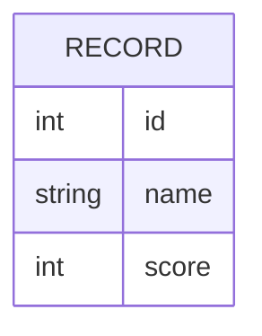

# Domain Model

Service2 holds a fixed catalog of scored records; Service1 reads that catalog
to compute an aggregate over it. The single entity below is the whole model.

`RECORD` is served in full (10 rows) in Service2's full mode, and as an empty
set in its empty mode — there is no other entity or relation in this system.