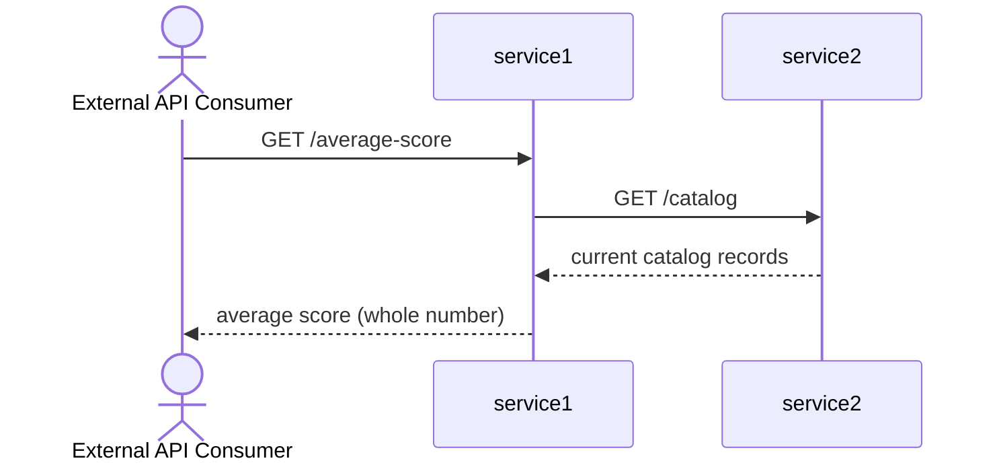

# Average score request

An External API Consumer asks Service1 for the average score of Service2's
current catalog, and Service1 computes it from whatever Service2 currently serves.

```mermaid
sequenceDiagram
    actor Consumer as External API Consumer
    participant service1
    participant service2

    Consumer->>service1: GET /average-score
    service1->>service2: GET /catalog
    service2-->>service1: current catalog records
    service1-->>Consumer: average score (whole number)
```

